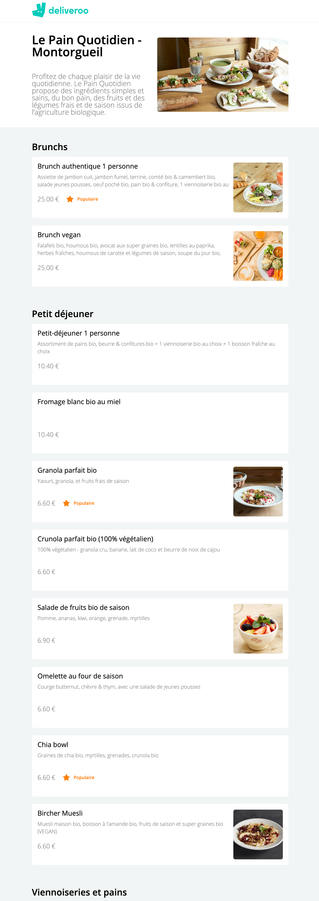
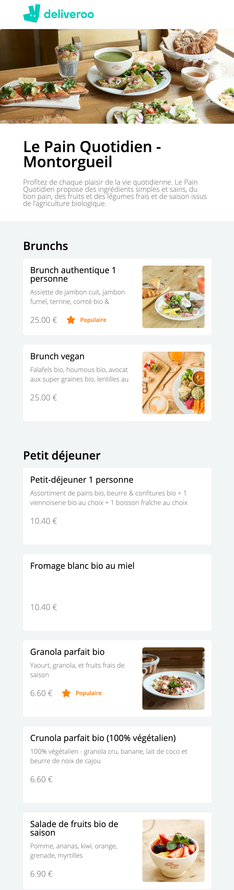

# deliveroo-frontend-LeReacteur

🗓 May 2021.  
👉🏻 Look at the backend repo!  
🪄 Frontend in React.js - Deliveroo page 🥖 Le Pain Quotidien.  
⇢ Check [that](https://mydeliveroo-lereacteur-2021.netlify.app/)

## Welcome in my school exercice (Deliveroo page)

### My work?

- Layout of Deliveroo page - Le Pain Quotidien
- Responsive design

## Languages

HTML5, CSS3 & React.js.

🙏🏻 Thank you @LeReacteur.
