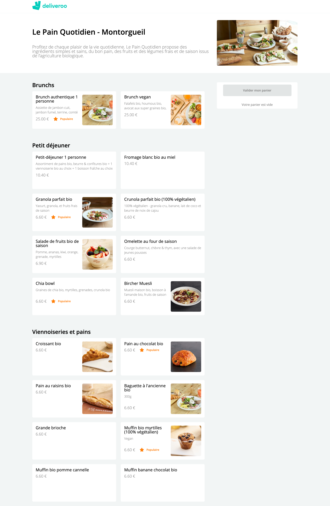
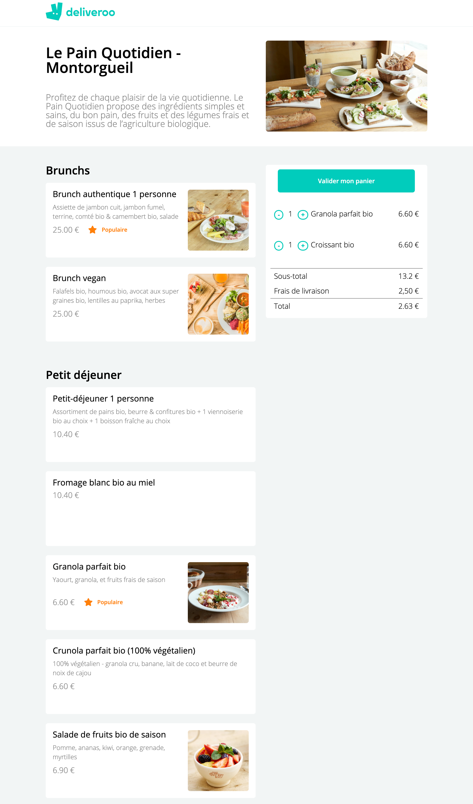
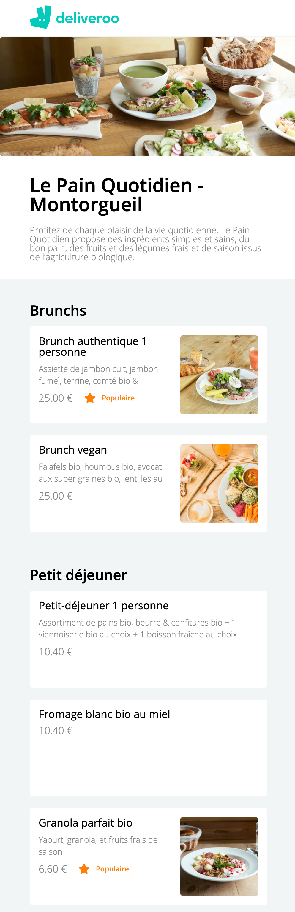

# DELIVEROO CLONE 🥐🥖

🌤 May 2021  
✨ Frontend  
🔗 Netlify - check [that](https://mydeliveroo-lereacteur-2021.netlify.app/) and test to add delicious croissant in your basket

## 🌈 Overview - Welcome dude

---

Deliveroo clone (Le Pain Quotidien page) made at [Le Reacteur](https://www.lereacteur.io/) Bootcamp.  
3 screens are availables: Le Pain Qutidien desktop (empty basket), Le Pain Quotidien tablette with breakfast to order & the mobile version.

  

## 👩🏻‍💻 Tasks

---

✘ Do integration (CSS and ReactJS)  
✘ Create components  
✘ Use states  
✘ Disable a button  
✘ Add products in basket  
✘ Delete a product  
✘ Increment or decrement a counter  
✘ Calculate sub-total and total price of a basket  
✘ Make responsive

## 📚 Stacks

---

[Javascript](https://www.w3schools.com/js/default.asp)  
[ReactJS](https://fr.reactjs.org/docs/getting-started.html)  
[HTML5](https://www.w3schools.com/html/default.asp)  
[CSS3](https://www.w3schools.com/css/default.asp)

## 🗝 Installation and usage

---

Be sure, you have installed all dependencies to the project.

### 🚙 Running the project

1️. Clone this repository

`git clone https://github.com/manon-boiteau/deliveroo-front-LeReacteur.git`

`cd deliveroo-front-LeReacteur`

2️. Install packages

`npm install`  
or  
`yarn`

3️. When installation is complete:

`yarn start`

🙏🏻 Thank you @LeReacteur.
